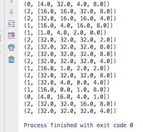

# Explain:
  My landlord is a super fan of England soccer team. He often say the England'soccer is the top team of the Europe. Although I am not a crazy football fan, I knew in 2014 FIFA World Cup Brasil, England even was eliminated in the group stage. So we had a aggressively discuss about how powerful of England's soccer. He is quite familiar with football, of course, I was lost in the "fighting". 
  Therefore, I decided to change another field to standing my unsatisfied: Data 
  I believe when he knows my logical analysis, he would apologize :)  
   
  
  At the beginning, I picked the England and other top 15 teams of 2014 European Cup to analyze their performance in 2002, 2006, 2010 and 2014. Those data from the website of FIFA. 
  The ranking is shown in this image 
   
  There is the ranking of thses 17 courties. In the programming, we need to delete the explanation and String name.  
  According to analyse the last 4 times European Cup ranking of 16 countries, we could divide the football into 3 levels of different countries 
  
  This is a typical clustering problem.
  Our program just clustered for 3 groups, the group name dont equal the football team ranking 
  
# Results
>  
> 	Group 1: England France 
> 	Group 2: Switzerland, Poland, Wales, Northern Ireland, Hungray, Belgium, Slovakia, Ireland and Iceland 
> 	Group 3: Portugal, German, Croatia, Italy and Spain</code> 
  
According to the clustering analyze, we have known that England's soccer team is not the top teams of Europe. Obviously, my landlord is wrong and I won in this debate. Yeeeeeeah~~ 

But the most surprising results is Croatia. Although Croatia is not storng as other group 3 countries, with smooth results it is better than England and France. 
 
# implement flow：
  1. read data in dataset 
  2. Randomly produce init-clusters 
  3. Calculate all spots of shortly distance to clusters, and reassign for 3 groups  
  4. updata the new cluster, and repeat step 3, until the position of clusters not change 
In step 2, program may produce invild clusters. For instance, the position beyond our examples(data). It could cause the error, so next step I would imporve it. 
   
#Reference:
https://www.coursera.org/learn/machine-learning/lecture/93VPG/k-means-algorithm  
http://www.cnblogs.com/leoo2sk/archive/2010/09/20/k-means.html   
https://github.com/wepe/MachineLearning/tree/master/KMeans  
